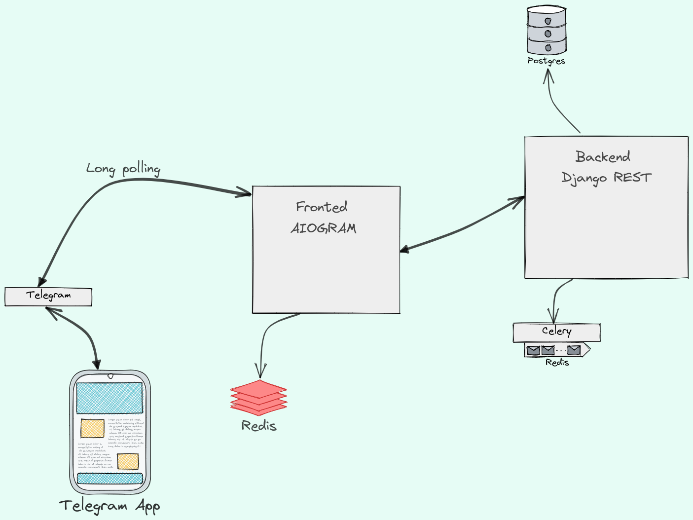
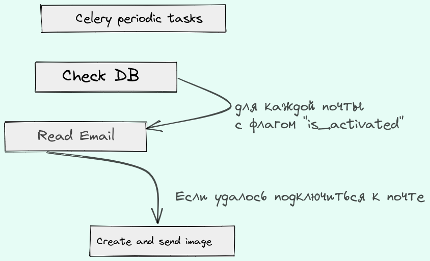

# EmailReaderBot

## Приложение позволяет получать письма с электронной почты в Telegram.

## Основные технологии разработки продукта

- Python 3.9
- Django 4
- Aiogram
- Celery 5.2.7
- Postgres 13
- Redis
- Docker

## Проект находится под NDA. Ниже приведен пример работы бота, общая схема архитектуры
### Пример работы

## _Общая схема проекта_

## Взаимодействие пользователя с ботом

- Start - Бот готов к работе
- Инструкции по настройке подключения по IMAP
- Добавить почту
- Блок управления почтой
- - Добавить/удалить отправителя
- - Изменить пароль
- - Удалить почту

## Обработка ошибок
- Пользователь вводит невалидный Email 
- Пользователь вводит некорректные данные(логин, пароль, домен)
- Пользователь пытается повторнно добавить почту

## Фичи
- Определение IMAP сервера
- Шифрование паролей
- Кэширование запросов на бэкенд

## _Логика запуска периодических задач_
